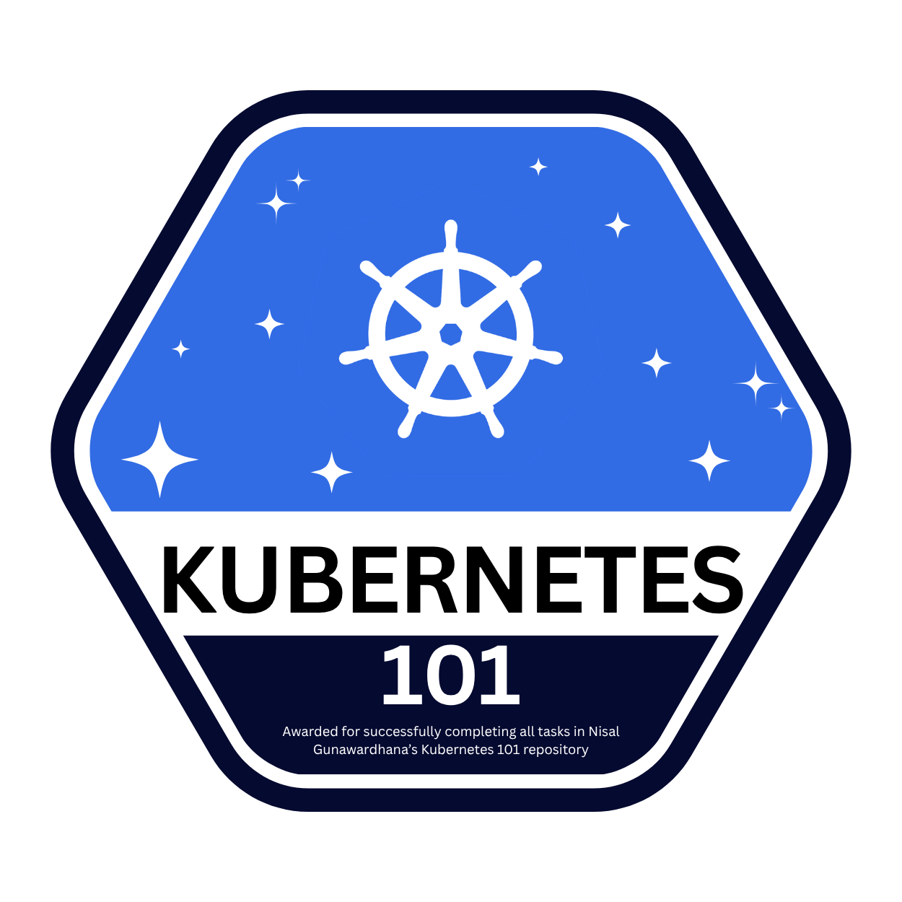

# 🏅 Submission Guidelines — Earn Your Kubernetes-101 Badge

Complete the **Main Task** (Deploy the Sample App), submit your screenshots through a Pull Request, open a Submission issue, and once it's reviewed and approved you'll automatically receive your completion badge:

<p align="center">
  
</p>

> ⚠️ **You only need to complete and submit the Main Task.** The smaller lesson tasks are optional practice — **you do NOT need to submit those.**

---

## 📌 Overview of the Process

```
1. Fork the repo
2. Create a branch:  submission/<your-username>
3. Complete the Main Task — take a screenshot at EACH step
4. Add all screenshots to  submissions/<your-username>/
5. Push your branch and open a Pull Request → to THIS repo's main branch
6. Copy your PR link
7. Open a Submission issue (form) with your details + PR link
8. Wait for review → issue closed → 🏅 badge awarded automatically
```

---

## Step 1 — Fork This Repository

Click the **Fork** button at the top-right of this repo's GitHub page. This creates your own copy under your account.

---

## Step 2 — Clone Your Fork & Create Your Submission Branch

```bash
# Clone YOUR fork
git clone https://github.com/<your-username>/Kubernetes-101.git
cd Kubernetes-101

# Create and switch to your submission branch
git checkout -b submission/<your-username>
```

> 📛 **Branch name must be:** `submission/<your-username>`
> Example: `submission/nisalgunawardhana`

---

## Step 3 — Complete the Main Task (Screenshot Each Step!)

Follow the [Main Task in the README](README.md#-main-task-deploy-the-sample-app). Take a **screenshot at every step** and save them into `submissions/<your-username>/`.

| Step | Command / Action | Screenshot file name |
|---|---|---|
| 1 | `minikube start` + `minikube status` | `step1-minikube-start.png` |
| 2 | `eval $(minikube docker-env)` | `step2-docker-env.png` |
| 3 | `docker build -t k8s101-app:latest .` | `step3-docker-build.png` |
| 4 | `kubectl apply -f k8s/...` (configmap, deployment, service) | `step4-kubectl-apply.png` |
| 5 | `kubectl get pods` showing `Running` | `step5-get-pods.png` |
| 6 | App open in your browser (showing pod name) | `step6-app-in-browser.png` |
| 7 | `kubectl scale ... --replicas=4` + `kubectl get pods` | `step7-scaled-pods.png` |

> 💡 The most important screenshot is **Step 6** — the running app in your browser showing the **pod name**.

Your folder should look like this:

```
submissions/
└── <your-username>/
    ├── step1-minikube-start.png
    ├── step2-docker-env.png
    ├── step3-docker-build.png
    ├── step4-kubectl-apply.png
    ├── step5-get-pods.png
    ├── step6-app-in-browser.png
    └── step7-scaled-pods.png
```

---

## Step 4 — Commit & Push Your Branch

```bash
git add submissions/<your-username>/
git commit -m "Submission: <your-username> — Main Task complete"
git push origin submission/<your-username>
```

---

## Step 5 — Open a Pull Request

1. Go to your fork on GitHub — you'll see a **"Compare & pull request"** button.
2. **IMPORTANT — set the PR target correctly:**
   - **base repository:** `nisalgunawardhana/Kubernetes-101`  →  **base branch:** `main`
   - **head repository:** `<your-username>/Kubernetes-101`  →  **compare branch:** `submission/<your-username>`

   > ✅ Your PR must target the **course repo's `main` branch** — NOT your own fork's main.

3. Title your PR: `Submission: <your-username>`
4. Click **Create pull request**.
5. **Copy the PR link** (e.g. `https://github.com/nisalgunawardhana/Kubernetes-101/pull/123`).

---

## Step 6 — Open a Submission Issue

1. Go to the **Issues** tab → **New issue** → choose **"🏅 Badge Submission"**.
2. Fill in the form:
   - **Full Name**
   - **GitHub Username**
   - **Pull Request Link** (the one you copied)
   - **Email Address**
   - **University**
3. Submit the issue.

### What happens next (automatic):

- ✅ A bot checks that your **PR link is valid**.
  - ❌ If the link is missing or invalid, the bot comments asking you to **fix your PR link** — correct it and the check re-runs.
  - ✅ If the link is valid, the issue is **assigned to the maintainer** and labeled **`pending-submission`**.
- 👀 The maintainer reviews your PR + screenshots.
- 🏅 When the maintainer **closes the issue**, you automatically receive a **comment with your completion badge** and the markdown to show it off.

> 🔒 Only the maintainer can approve. The badge is **only** awarded when **the maintainer closes the issue** — closing it yourself will not award a badge.

---

## 🎉 Display Your Badge

After approval, copy the badge markdown from the bot's comment into your own README or profile:

```markdown

```

---

## ❓ FAQ

**Do I need to submit every lesson task?**
No. Only the **Main Task**. Lesson tasks are optional practice.

**My PR link check failed — what do I do?**
Edit your issue (or comment) with the correct PR link. Make sure the PR targets `nisalgunawardhana/Kubernetes-101` → `main`.

**When do I get the badge?**
Only after the maintainer reviews and **closes** your submission issue.

---

Happy shipping! ☸️🏅
