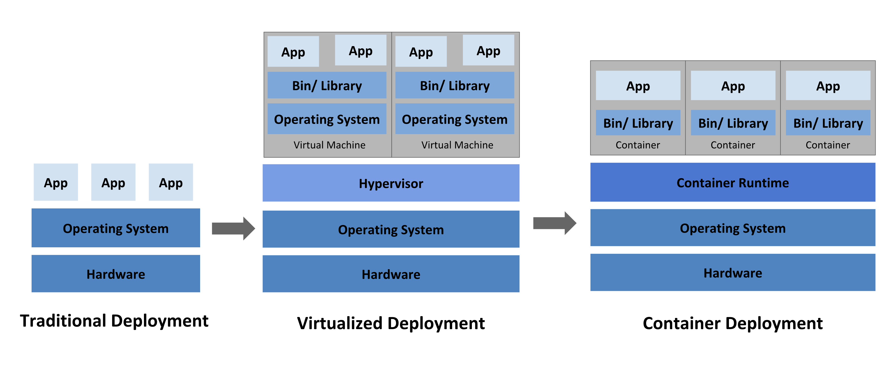

# Lesson 01 — What is Kubernetes?

## 🎯 Learning Objectives
By the end of this lesson you will be able to:
- Explain what Kubernetes is in your own words
- Understand why Kubernetes exists and the problem it solves
- Know the difference between containers, Docker, and Kubernetes

---

## The Problem Kubernetes Solves

Imagine you have a web app running in a Docker container. It works great on your laptop. Now you need to:

- Run **10 copies** of it for traffic
- **Restart it automatically** if it crashes
- **Update it** without downtime
- **Balance traffic** across all 10 copies
- Run it across **multiple machines**

Doing all of this manually is a nightmare. That's exactly why Kubernetes was built.

> **Kubernetes (K8s)** is an open-source system for **automating deployment, scaling, and management** of containerized applications.

It was originally designed by Google, based on their internal system called "Borg", and donated to the Cloud Native Computing Foundation (CNCF) in 2014.

---

## Key Concepts

### Containers vs Kubernetes

| Docker | Kubernetes |
|---|---|
| Packages your app into a container | Manages many containers across machines |
| Runs one container at a time (mostly) | Runs thousands of containers automatically |
| Manual scaling | Auto-scaling |
| No self-healing | Restarts failed containers automatically |

Think of it this way:
- **Docker** = a shipping container
- **Kubernetes** = the entire port that manages thousands of shipping containers

### Why "K8s"?
The "8" replaces the 8 letters between "K" and "s" in "Kubernetes". It's just a shorthand nickname.

---

## What Kubernetes Does For You

✅ **Self-healing** — If a container crashes, Kubernetes restarts it automatically  
✅ **Scaling** — Scale from 1 pod to 100 pods with one command  
✅ **Load balancing** — Distributes traffic evenly  
✅ **Rolling updates** — Deploy new versions with zero downtime  
✅ **Config management** — Manage secrets and config separately from your app  
✅ **Storage orchestration** — Automatically mount storage  

---

## Real-World Analogy

Think of Kubernetes as an **airline operations manager**:

- Planes (containers) need to take off, land, and be maintained
- If a plane breaks down, a replacement is sent immediately
- Passengers (traffic) are routed to available planes
- The whole system runs automatically — you don't manage each plane individually

## ✅ Quick Check

Answer these in your own words before moving on:
1. What problem does Kubernetes solve?
2. What is the difference between Docker and Kubernetes?
3. Name 3 things Kubernetes does automatically.

---

## 🏁 Task

**Task 1.1 — Explore Kubernetes**

1. Go to [kubernetes.io](https://kubernetes.io) and read the "What is Kubernetes" page
2. Write a 3-sentence summary in your own words (in a file called `my-notes.md` in this folder)
3. Find one company that uses Kubernetes in production and note what they use it for

---

## 📚 Further Reading
- [Kubernetes Official Docs — Overview](https://kubernetes.io/docs/concepts/overview/)
- [CNCF Kubernetes Introduction](https://www.cncf.io/projects/kubernetes/)
