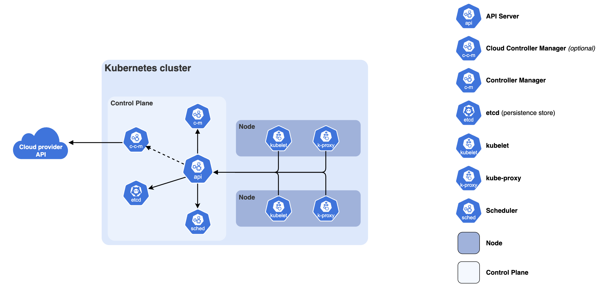
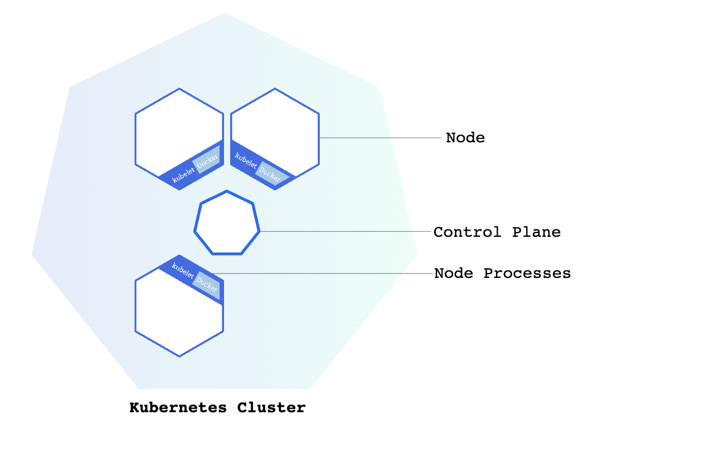

# Lesson 02 — Kubernetes Components A-Z

## 🎯 Learning Objectives
- Understand every major Kubernetes component
- Know the difference between Control Plane and Worker Nodes
- Understand how components talk to each other

---

## The Big Picture

A Kubernetes **cluster** has two main parts:




---

## Control Plane Components

### 1. kube-apiserver
The **front door** of Kubernetes. Every command you run (`kubectl get pods`) goes through the API server.

- Validates and processes requests
- Is the only component that talks to `etcd`
- Exposes the Kubernetes REST API

### 2. etcd
The **database** of Kubernetes. Stores all cluster state and configuration.

- Key-value store
- If etcd dies, the whole cluster loses its state
- Should always be backed up in production

### 3. kube-scheduler
Decides **which node** a new Pod runs on.

- Looks at available resources (CPU, memory)
- Respects constraints you define (node labels, taints)
- Does NOT start the pod — just picks the node

### 4. kube-controller-manager
Runs **control loops** that watch the cluster state and make things match what you want.

Includes:
- **Node Controller** — notices when nodes go down
- **Deployment Controller** — ensures correct number of pods
- **Service Account Controller** — creates default accounts

### 5. cloud-controller-manager
(Only in cloud environments like AWS/GCP/Azure)
Manages cloud-specific resources like load balancers and storage volumes.

---

## Worker Node Components

### 6. kubelet
The **agent** that runs on every worker node.

- Receives instructions from the API server
- Starts and stops containers via the container runtime
- Reports node/pod status back to the control plane

### 7. kube-proxy
Handles **network rules** on each node.

- Maintains network rules for Pod communication
- Implements part of the Kubernetes Service concept
- Uses Linux iptables or IPVS under the hood

### 8. Container Runtime
The software that **actually runs containers**.

Examples:
- `containerd` (most common)
- `CRI-O`
- Docker Engine (deprecated in newer K8s)

---

## Kubernetes Objects (What You Deploy)

### Pod
The **smallest deployable unit** in Kubernetes.

- Contains one or more containers
- Has its own IP address
- Ephemeral — can be killed and replaced anytime

```yaml
apiVersion: v1
kind: Pod
metadata:
  name: my-pod
spec:
  containers:
  - name: my-app
    image: nginx
```

### Deployment
Manages a **set of identical Pods**.

- Ensures N replicas are always running
- Handles rolling updates
- The thing you usually create (not Pods directly)

### ReplicaSet
Ensures a **specific number of Pod replicas** are running.

- Usually managed by a Deployment (you rarely create these directly)

### Service
A **stable network endpoint** for a set of Pods.

- Pods come and go, but the Service IP stays the same
- Types: ClusterIP, NodePort, LoadBalancer

### ConfigMap
Stores **non-sensitive configuration** as key-value pairs.

- Inject into Pods as environment variables or files
- Change config without rebuilding your image

### Secret
Like ConfigMap but for **sensitive data** (passwords, tokens).

- Base64 encoded (not encrypted by default!)
- Should use encryption at rest in production

### Namespace
A way to **divide cluster resources** between teams/projects.

```bash
kubectl get pods -n kube-system    # system namespace
kubectl get pods -n default        # your default namespace
```

### PersistentVolume (PV) & PersistentVolumeClaim (PVC)
For **persistent storage** that survives Pod restarts.

- PV = the actual storage (disk)
- PVC = a request for storage from a Pod

### Ingress
Manages **external HTTP/S access** to Services.

- Route traffic based on hostname or URL path
- Handles SSL/TLS termination

---

## Component Communication Flow

```
You run: kubectl apply -f deployment.yaml
           │
           ▼
    kube-apiserver  ←→  etcd (stores desired state)
           │
           ▼
    kube-scheduler  (picks a node)
           │
           ▼
    kubelet on that node  (starts the container)
           │
           ▼
    Container Runtime  (pulls image, runs container)
```

---

## ✅ Quick Check
1. What is the role of `etcd`?
2. What's the difference between a Pod and a Deployment?
3. Which component decides which node a Pod runs on?
4. What's the difference between ConfigMap and Secret?

---

## 🏁 Task

**Task 2.1 — Draw the Architecture**

1. Draw (by hand or digitally) a Kubernetes cluster architecture diagram showing:
   - All Control Plane components
   - Worker Node components
   - At least 2 worker nodes
   - Arrows showing how components communicate

2. Label every component with a one-sentence description
---

## 📚 Further Reading
- [Kubernetes Components Docs](https://kubernetes.io/docs/concepts/overview/components/)
