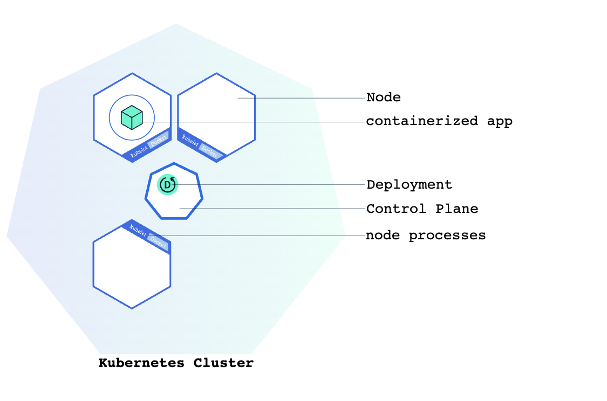

# Lesson 04 — Using kubectl to Create a Deployment

## 🎯 Learning Objectives
- Understand what kubectl is
- Create a Deployment using kubectl
- Understand YAML manifest files

---


## What is kubectl?

`kubectl` (pronounced "kube-control" or "kube-c-t-l") is the command-line tool for talking to your Kubernetes cluster.

Every command you run goes to the **kube-apiserver**.

---

## kubectl Basics

```bash
# Syntax
kubectl [command] [resource-type] [resource-name] [flags]

# Examples
kubectl get pods
kubectl get deployments
kubectl describe pod my-pod
kubectl delete deployment my-app
kubectl apply -f my-file.yaml
```

---

## Creating a Deployment

### Method 1 — Imperative (quick, for testing)
```bash
kubectl create deployment hello-k8s --image=nginx
```

### Method 2 — Declarative (recommended, using YAML)

Create `deployment.yaml`:
```yaml
apiVersion: apps/v1
kind: Deployment
metadata:
  name: hello-k8s
  labels:
    app: hello-k8s
spec:
  replicas: 1
  selector:
    matchLabels:
      app: hello-k8s
  template:
    metadata:
      labels:
        app: hello-k8s
    spec:
      containers:
      - name: nginx
        image: nginx:latest
        ports:
        - containerPort: 80
```

Apply it:
```bash
kubectl apply -f deployment.yaml
```

---

## Checking Your Deployment

```bash
# See deployments
kubectl get deployments

# See pods created by the deployment
kubectl get pods

# Detailed info
kubectl describe deployment hello-k8s

# Watch pods in real-time
kubectl get pods -w
```

---

## Understanding the YAML Fields

| Field | Meaning |
|---|---|
| `apiVersion` | Which API version to use |
| `kind` | Type of object (Deployment, Service, Pod...) |
| `metadata.name` | Name of this resource |
| `spec.replicas` | How many pod copies to run |
| `spec.selector` | How the deployment finds its pods |
| `spec.template` | The pod template (what each pod looks like) |
| `containers.image` | Docker image to run |

---

## ✅ Quick Check
1. What is the difference between `kubectl create` and `kubectl apply`?
2. What does `replicas: 3` mean in a Deployment?
3. What does `kubectl describe` show you?


## 📚 Further Reading
- [kubectl Overview](https://kubernetes.io/docs/reference/kubectl/overview/)
- [Deployments](https://kubernetes.io/docs/concepts/workloads/controllers/deployment/)
