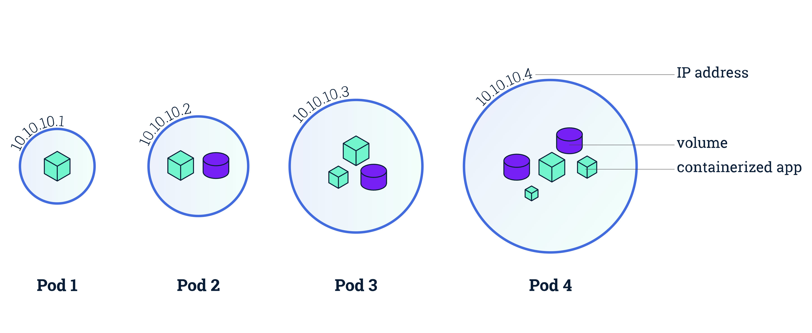
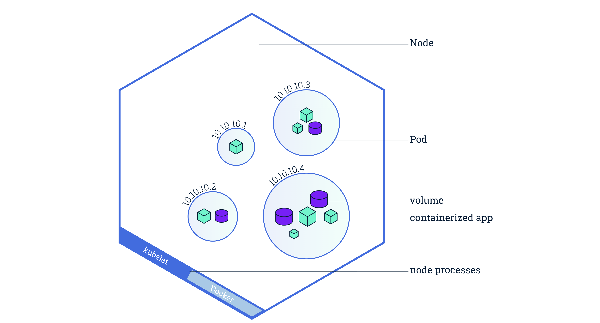

# Lesson 05 — Viewing Pods and Nodes

## 🎯 Learning Objectives
- Understand the relationship between Pods and Nodes
- Use kubectl to inspect Pods and Nodes
- Understand Pod lifecycle

---

## Pods vs Nodes

| Concept | Description |
|---|---|
| **Node** | A machine (VM or physical) that runs workloads |
| **Pod** | The smallest deployable unit — runs your containers |


A **Node** can run many **Pods**.
A **Pod** runs on exactly one **Node** at a time.

Pods overview


Nodes overview


---

## Inspecting Nodes

```bash
# List nodes
kubectl get nodes

# Detailed node info (resources, conditions, events)
kubectl describe node minikube

# Node resource usage
kubectl top node          # requires metrics-server addon
```

---

## Inspecting Pods

```bash
# All pods in default namespace
kubectl get pods

# All pods in ALL namespaces
kubectl get pods -A

# Wide output (shows which node each pod is on)
kubectl get pods -o wide

# Watch pods in real-time
kubectl get pods -w

# Detailed pod info
kubectl describe pod <pod-name>

# View pod logs
kubectl logs <pod-name>

# Follow logs (like tail -f)
kubectl logs -f <pod-name>

# Shell into a running pod
kubectl exec -it <pod-name> -- /bin/bash
```

---

## Pod Lifecycle

```
Pending → Running → Succeeded
                 ↘ Failed
                 ↘ CrashLoopBackOff  (keeps crashing)
                 ↘ OOMKilled         (out of memory)
```

| Status | Meaning |
|---|---|
| `Pending` | Pod is scheduled but not started yet |
| `Running` | Pod is running normally |
| `Succeeded` | Pod completed and exited successfully |
| `Failed` | Pod exited with an error |
| `CrashLoopBackOff` | Pod keeps crashing and restarting |
| `ImagePullBackOff` | Can't pull the Docker image |

---

## ✅ Quick Check
1. Can one Pod run on two Nodes? Why or why not?
2. What does `CrashLoopBackOff` mean?
3. How do you see the logs of a pod?

## 📚 Further Reading
- [Pod Lifecycle](https://kubernetes.io/docs/concepts/workloads/pods/pod-lifecycle/)
- [Debug Running Pods](https://kubernetes.io/docs/tasks/debug/debug-application/debug-running-pod/)
